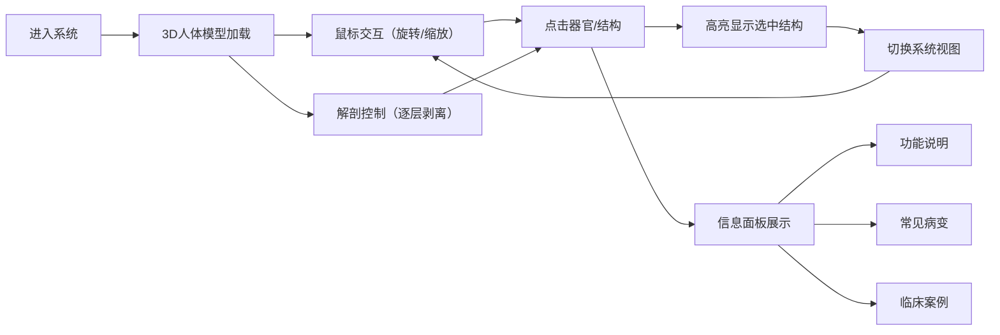

## 1. 产品概述

面向医学生和临床医生的3D虚拟解剖教学系统，解决传统解剖标本稀缺、学习成本高、无法重复操作的痛点。基于高精度人体解剖模型，提供沉浸式的虚拟解剖学习体验。

- **核心价值**：让医学教育摆脱实体标本限制，随时随地进行解剖学习
- **目标用户**：医学院学生、临床医生、医学教育工作者
- **市场定位**：专业医学教育工具，替代/补充传统解剖教学

## 2. 核心功能

### 2.1 用户角色

| 角色 | 注册方式 | 核心权限 |
|------|----------|----------|
| 访客用户 | 无需注册 | 体验基础解剖功能，查看部分结构信息 |
| 注册用户 | 邮箱/手机注册 | 完整解剖功能，所有器官信息，保存学习进度 |

### 2.2 功能模块

1. **主界面**：3D人体模型展示区、系统导航、功能控制区
2. **解剖操作区**：分层剥离控制、旋转缩放、结构选取
3. **信息面板**：器官功能说明、常见病变、临床案例展示
4. **系统选择**：循环系统、神经系统、消化系统等分类浏览

### 2.3 页面详情

| 页面名称 | 模块名称 | 功能描述 |
|-----------|-------------|---------------------|
| 主界面 | 3D场景模块 | 高精度人体模型展示，支持鼠标旋转、缩放、平移 |
| 主界面 | 解剖控制模块 | 从皮肤→脂肪→肌肉→内脏→骨骼的逐层剥离/恢复按钮 |
| 主界面 | 结构选取模块 | 点击任意解剖结构高亮显示并显示信息面板 |
| 主界面 | 信息面板模块 | 展示选中结构的功能说明、常见病变、真实临床案例 |
| 主界面 | 系统导航模块 | 快速切换不同人体系统（骨骼、肌肉、神经、循环等） |
| 主界面 | 视图控制模块 | 重置视角、三视图切换（正面/侧面/背面）、透视开关 |

## 3. 核心流程

用户进入系统后，首先看到完整的3D人体模型。可以通过鼠标旋转查看不同角度，通过解剖控制按钮逐层剥离组织。点击感兴趣的结构后，右侧信息面板会显示详细的医学知识。用户可以在任意层次进行学习，也可以快速切换到特定系统进行深入研究。

## 4. 用户界面设计

### 4.1 设计风格
- **主色调**：深邃蓝 (#0A1628) 作为背景主色，搭配医学蓝 (#1E88E5) 作为强调色
- **辅助色**：器官高亮使用青色 (#00BCD4)，警告/病变使用橙红色 (#FF5722)
- **按钮风格**：圆角矩形，玻璃拟态效果，悬停时有微动画
- **字体**：标题使用 Orbitron（科技感字体），正文使用 Noto Sans SC
- **布局风格**：沉浸式3D场景居中，控制面板悬浮于四周，玻璃质感边框
- **图标风格**：线性轮廓图标，医学专业风格，简洁清晰

### 4.2 页面设计概述

| 页面名称 | 模块名称 | UI Elements |
|-----------|-------------|-------------|
| 主界面 | 3D场景模块 | 全屏3D渲染，柔和环境光，器官材质半透明效果，选中时发光高亮 |
| 主界面 | 解剖控制模块 | 左侧垂直按钮组，层次进度条，当前层次指示动画 |
| 主界面 | 信息面板模块 | 右侧可折叠面板，标签页切换（功能/病变/案例），卡片式内容布局 |
| 主界面 | 系统导航模块 | 顶部胶囊式导航栏，当前选中项发光效果 |
| 主界面 | 视图控制模块 | 右下角圆形按钮组，悬停展开，点击反馈动画 |

### 4.3 响应性
- **Desktop-first** 设计，针对大屏幕医学教学场景优化
- 支持平板设备适配，触摸手势操作（双指缩放、旋转）
- 信息面板可折叠，小屏幕下自动变为底部抽屉

### 4.4 3D场景指导
- **环境/HDRI**：暗色医学实验室氛围，冷色调环境光，避免杂乱反射
- **光照设置**：主光源45度角照射，环境光补光，器官边缘轮廓光，选中结构发射光
- **相机设置**：初始距离1.5倍模型高度，OrbitControls控制，限制俯仰角避免穿模
- **构图焦点**：人体模型居中，留足四周空间放置控制面板
- **交互动画**：结构剥离时有渐隐+下沉动画，选中时有轻微放大+发光脉冲
- **后处理效果**：Bloom发光效果（选中结构），轻微景深模糊背景，SSAO环境光遮蔽
- **性能优化**：使用简化几何体作为演示模型，材质共享，帧率目标60fps
