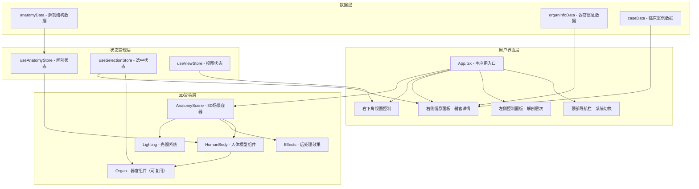

## 1. 架构设计



## 2. 技术描述

- **前端框架**：React@18 + TypeScript
- **构建工具**：Vite@5
- **样式方案**：TailwindCSS@3
- **3D引擎**：three@0.160
- **React 3D 绑定**：@react-three/fiber@8.15 + @react-three/drei@9.92
- **后处理效果**：@react-three/postprocessing@2.15
- **状态管理**：zustand@4.4
- **动画库**：framer-motion@10.16
- **字体**：Orbitron（标题）、Noto Sans SC（正文）

## 3. 核心技术说明

### 3.1 3D渲染方案
- 使用 `@react-three/fiber` 将 Three.js 声明式集成到 React
- 使用 `@react-three/drei` 提供 OrbitControls、Environment 等常用组件
- 使用 `@react-three/postprocessing` 实现 Bloom 发光、SSAO 等后处理效果
- 人体模型使用程序化生成的几何体（避免外部模型依赖），各器官使用胶囊体、球体、椭球体等组合

### 3.2 解剖层次实现
- 定义5个解剖层次：皮肤层 → 脂肪层 → 肌肉层 → 内脏层 → 骨骼层
- 每层包含对应的 Mesh 组件组，通过 visible 属性和 opacity 动画控制显示/隐藏
- 使用 zustand 管理当前解剖层次状态，各组件订阅状态变化

### 3.3 交互系统
- Raycaster 实现鼠标拾取，点击器官时触发选中状态
- 选中器官应用 emissive 发光材质 + 轻微放大动画
- 信息面板通过 framer-motion 实现平滑展开/收起

### 3.4 数据设计
- 所有解剖数据、器官信息、临床案例均使用 Mock 数据
- 数据结构标准化，便于后续接入真实医学数据库

## 4. 目录结构

```
src/
├── components/
│   ├── ui/                 # 基础UI组件
│   │   ├── GlassButton.tsx
│   │   ├── GlassPanel.tsx
│   │   └── TabSwitcher.tsx
│   ├── layout/             # 布局组件
│   │   ├── TopNavbar.tsx
│   │   ├── LeftControlPanel.tsx
│   │   ├── RightInfoPanel.tsx
│   │   └── ViewControls.tsx
│   └── three/              # 3D组件
│       ├── AnatomyScene.tsx
│       ├── HumanBody.tsx
│       ├── Organ.tsx
│       ├── Lighting.tsx
│       └── PostEffects.tsx
├── store/                  # 状态管理
│   ├── useAnatomyStore.ts
│   ├── useSelectionStore.ts
│   └── useViewStore.ts
├── data/                   # Mock数据
│   ├── anatomyData.ts
│   ├── organInfoData.ts
│   └── caseData.ts
├── types/                  # 类型定义
│   └── index.ts
├── App.tsx
├── main.tsx
└── index.css
```

## 5. 数据模型

### 5.1 解剖结构类型定义

```typescript
// 解剖层次枚举
enum AnatomyLayer {
  SKIN = 'skin',
  FAT = 'fat',
  MUSCLE = 'muscle',
  ORGAN = 'organ',
  SKELETON = 'skeleton'
}

// 人体系统枚举
enum BodySystem {
  INTEGUMENTARY = 'integumentary',
  MUSCULAR = 'muscular',
  SKELETAL = 'skeletal',
  NERVOUS = 'nervous',
  CIRCULATORY = 'circulatory',
  RESPIRATORY = 'respiratory',
  DIGESTIVE = 'digestive',
  ENDOCRINE = 'endocrine'
}

// 器官/结构定义
interface AnatomyStructure {
  id: string;
  name: string;
  latinName: string;
  layer: AnatomyLayer;
  system: BodySystem;
  geometry: {
    type: 'box' | 'sphere' | 'capsule' | 'cylinder' | 'ellipsoid';
    position: [number, number, number];
    rotation?: [number, number, number];
    scale: [number, number, number];
    color: string;
  };
}

// 器官信息
interface OrganInfo {
  id: string;
  structureId: string;
  function: string;
  description: string;
  commonPathologies: Pathology[];
  clinicalCases: ClinicalCase[];
}

// 常见病变
interface Pathology {
  id: string;
  name: string;
  description: string;
  symptoms: string[];
  treatment: string;
  severity: 'mild' | 'moderate' | 'severe';
}

// 临床案例
interface ClinicalCase {
  id: string;
  title: string;
  patientInfo: string;
  presentation: string;
  diagnosis: string;
  treatment: string;
  outcome: string;
  imageUrl?: string;
}
```

## 6. 组件通信

- **状态共享**：使用 zustand stores 实现跨组件状态共享
- **事件驱动**：选中器官时通过 useSelectionStore 广播选中事件
- **React Three Fiber**：使用 useFrame hook 实现动画帧更新
- **UI 动画**：framer-motion 处理面板展开、按钮悬停等动画效果
